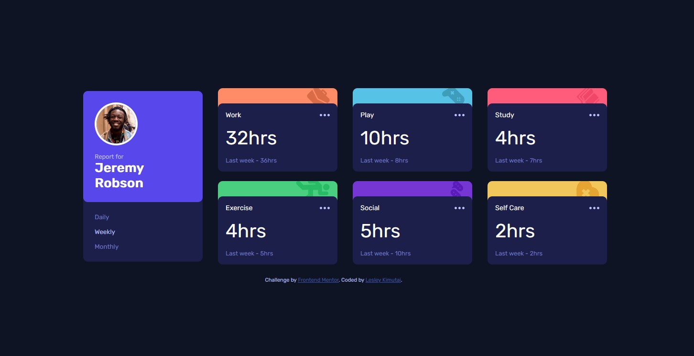

# Frontend Mentor - Time tracking dashboard solution

This is a solution to the [Time tracking dashboard challenge on Frontend Mentor](https://www.frontendmentor.io/challenges/time-tracking-dashboard-UIQ7167Jw). Frontend Mentor challenges help you improve your coding skills by building realistic projects. 

## Table of contents

- [Frontend Mentor - Time tracking dashboard solution](#frontend-mentor---time-tracking-dashboard-solution)
  - [Table of contents](#table-of-contents)
  - [Overview](#overview)
    - [The challenge](#the-challenge)
    - [Screenshot](#screenshot)
    - [Links](#links)
  - [My process](#my-process)
    - [Built with](#built-with)
    - [What I learned](#what-i-learned)
    - [Continued development](#continued-development)
  - [Author](#author)

## Overview

### The challenge

Users should be able to:

- View the optimal layout for the site depending on their device's screen size
- See hover states for all interactive elements on the page
- Switch between viewing Daily, Weekly, and Monthly stats

### Screenshot

Mockup screenshot :- 


### Links

- Solution URL: [Github Link](https://github.com/issagoodlifeInc/timetracking-dashboard.git)
- Live Site URL: [Time Tracking (Netlify)](https://timetrackdash.netlify.app/)

## My process

### Built with

- Semantic HTML5 markup
- CSS custom properties
- Flexbox
- CSS Grid
- Mobile-first workflow
- [React](https://reactjs.org/) - JS library


### What I learned

Adding the background to the time cards and their associated image using the `nth-child()` selector.
```css
/* Backgroud of The Cards */
.card::before {
  content: "";
  position: absolute;
  top: -2rem;
  left: 0;
  right: 0;
  height: 3rem;
  width: 100%;
  z-index: -1;
  border-radius: 10px;
}
main :nth-child(n)::before {
  background-repeat: no-repeat;
  background-position: top -0.2rem right 1rem;
  background-size: contain;
}

main :nth-child(2)::before {
  background-color: var(--lightorange);
  background-image: url("../src/images/icon-work.svg");
}
main :nth-child(3)::before {
  background-color: var(--softblue);
  background-image: url("../src/images/icon-play.svg");
}
/* upto the last child :nth-child(7) */
```
Used a `switch`to handle the `timeframes` 

```js
switch (timeframe) {
      case "Monthly":
        currentTime = card.timeframes.monthly.current;
        lastWeekTime = card.timeframes.monthly.previous;
        break;
      case "Daily":
        currentTime = card.timeframes.daily.current;
        lastWeekTime = card.timeframes.daily.previous;
        break;
      default:
        currentTime = card.timeframes.weekly.current;
        lastWeekTime = card.timeframes.weekly.previous;
        break;
    }
```

### Continued development

Writing better code .. I repeated similar styles to handle the color of the btns when its selected. Redundancy 

```js
// /* // <>>>>>>> Change color when timeframe matches the btn text */
  const btnDaily = {
    color: timeframe === "Daily" ? "var(--paleblue)" : "var(--desaturatedblue)",
  };
  const btnWeekly = {
    color:
      timeframe === "Weekly" ? "var(--paleblue)" : "var(--desaturatedblue)",
  };
  const btnMonthly = {
    color:
      timeframe === "Monthly" ? "var(--paleblue)" : "var(--desaturatedblue)",
  };
  <div className="btns">
        <button
          className="btn_timeframe"
          onClick={handleclick}
          style={btnDaily}
        >
          Daily
        </button>
        <button
          className="btn_timeframe"
          onClick={handleclick}
          style={btnWeekly}
        >
          Weekly
        </button>
        <button
          className="btn_timeframe"
          onClick={handleclick}
          style={btnMonthly}
        >
          Monthly
        </button>
      </div>
```

## Author

- Frontend Mentor - [@Leskim](https://www.frontendmentor.io/profile/Leskim)

